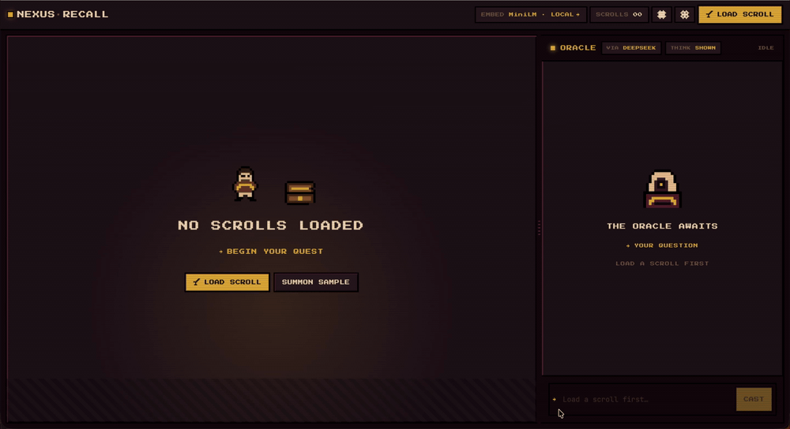

# Nexus Recall

> Browser-first RAG document explorer with a dark-fantasy RPG aesthetic.
> Upload PDFs and Markdown scrolls, embed them locally with Transformers.js, and interrogate them through the Oracle — a streaming AI chat powered by Fireworks.ai (or Claude).




📖 **[How it works under the hood →](https://nexus-recall.vercel.app/how-it-works.html)** (live deep-dive page) · **[Conventions & FAQ →](docs/CONVENTIONS.md)**

---

## Quickstart

Requires **Node ≥ 24** and **pnpm** (`corepack enable` picks up the pinned version).

```sh
cp .env.example .env
# fill in FIREWORKS_API_KEY (required) — see Environment Variables below
pnpm install
pnpm dev
```

App runs at `http://localhost:5173`.

---

## Features

- **Drag & drop ingestion** — PDF and Markdown files parsed entirely in the browser
- **Local-first embeddings** — `@xenova/transformers` in a Web Worker; nothing leaves your machine unless you opt in to cloud embeddings
- **Markdown-aware chunking** — LangChain.js `RecursiveCharacterTextSplitter` / `MarkdownTextSplitter`, 800-char chunks with 120-char overlap, nearest heading prepended
- **IndexedDB vector store** — chunks persist across sessions via `idb`; in-memory cosine similarity search with per-document scoping
- **Cross-encoder reranking** — `ms-marco-MiniLM-L-6-v2`, warmed via `/api/warmup`, with graceful fallback to vector order
- **Streaming RAG answers** — Vercel AI SDK `streamText` → `createUIMessageStream`; Fireworks.ai (default) or Claude
- **Deterministic citations** — derived directly from the reranked chunks (no extra LLM call), validated by Zod; click a `[n]` to scroll the viewer to the source
- **Live reasoning** — chain-of-thought is intercepted server-side and shown in a separate panel, never mixed into the answer
- **Per-answer cost** — token usage + USD cost computed server-side and shown under each reply
- **PWA** — installable, works offline for already-indexed documents
- **Eval system** — BM25 recall@k / MRR + LLM-as-judge faithfulness + embedding-based answer similarity & relevance, with a CI quality gate (`pnpm eval`)

---

## Architecture

Strictly layered — dependencies flow one way (UI → API → AI/RAG):

```
Browser (Svelte 5 runes)
├── routes/+page.svelte         split-pane: Tome (viewer) | Oracle (chat)
├── components/
│   ├── DocumentViewer.svelte    PDF/MD render + highlight overlays
│   ├── ChatPanel.svelte         orchestrator → oracle/{OracleHeader,MessageList,OracleInput,…}
│   └── …                        Hud, DocumentTabs, IngestProgress, SettingsModal, …
├── stores/                      ingestion state machine, apiKeys, theme, toast, reasoning
├── utils/                       pure, tested helpers (cite-match, format, oracle-markdown)
└── rag/  (runs in the browser / Web Worker)
    ├── parser.ts                pdfjs-dist + markdown
    ├── parse-text.ts            shared text extraction helpers
    ├── chunker.ts               LangChain splitters, source::page::index chunk IDs
    ├── embeddings.ts            Transformers.js worker (MiniLM/MPNet) or OpenAI
    └── vector-store.ts          IndexedDB + cosine similarity (sourceFilter)

Server (Vercel, @sveltejs/adapter-vercel)
├── routes/api/chat/
│   ├── +server.ts               key resolution → validation → provider select → rerank → stream
│   ├── chat.keys.ts             header keys → demo env → 401; provider fallback chain
│   ├── chat.models.ts           env-overridable model IDs + model factory
│   ├── chat.context.ts          <source n> assembly (injection-delimited) + citations
│   ├── chat.schema.ts           Zod request/citation schemas + input sanitization
│   ├── chat.stream.ts           reasoning interceptor + cost/usage on finish
│   ├── chat.pricing.ts          provider pricing map → server-side USD cost
│   └── chat.logger.ts           request-scoped structured JSON logs
├── routes/api/warmup/+server.ts warms the reranker singleton
├── routes/api/health/+server.ts liveness + config probe
└── lib/server/reranker.ts       cross-encoder cold-start singleton + fallback
```

---

## Environment Variables

Copy `.env.example` to `.env` and fill in the values:

| Variable            | Required | Where to get it                                                              |
| ------------------- | -------- | ---------------------------------------------------------------------------- |
| `FIREWORKS_API_KEY` | Yes\*    | [fireworks.ai](https://fireworks.ai) — free tier available                   |
| `ANTHROPIC_API_KEY` | No       | [console.anthropic.com](https://console.anthropic.com) — for Claude answers  |
| `OPENAI_API_KEY`    | No       | [platform.openai.com](https://platform.openai.com) — for cloud embeddings    |
| `DEMO_KEYS_ENABLED` | No       | `true` to let the server fall back to the keys above when a request has none |
| `FIREWORKS_MODEL`   | No       | override the default Fireworks model id                                      |
| `ANTHROPIC_MODEL`   | No       | override the default Anthropic model id                                      |

\* Required for server-side demo mode. Otherwise users supply their own keys via
the Settings panel; LLM keys travel as request **headers** and are resolved
server-side (never logged). Cloud-embedding keys are used client-side — see
[ADR 0001](docs/adr/0001-client-side-own-keys.md).

---

## Security & guardrails

- **Prompt injection** — retrieved document text is wrapped in `<source n="…">`
  tags and the system prompt treats it as untrusted data; instructions found
  inside a scroll are ignored.
- **Key handling** — user keys via headers → demo env fallback → 401; keys never
  appear in logs.
- **Input boundary** — Zod validates length and provider; null bytes / control
  chars are stripped from the question.
- **Provider fallback** — `resolveProvider` expresses primary → fallback → error
  in code, not a runbook.
- **Cost envelope** — usage + USD cost are computed server-side from day one and
  surfaced per answer; rates live in one `chat.pricing.ts` map.
- **Security headers** — `vercel.json` sets `X-Frame-Options: DENY` (anti-
  clickjacking), `X-Content-Type-Options: nosniff`, `Referrer-Policy:
strict-origin-when-cross-origin`, a deny-by-default `Permissions-Policy`, and
  HSTS — alongside the COOP/COEP the WASM worker needs. A
  `Content-Security-Policy` is owned by SvelteKit's `kit.csp` (so it can
  hash/nonce the inline hydration script — `script-src` stays `'self'
  'wasm-unsafe-eval'`, no script `'unsafe-inline'`); `connect-src` allows the
  HuggingFace CDN the in-browser embedder downloads MiniLM from.

---

## Observability

- **Structured logs** — every request gets a `requestId`-scoped JSON-line logger
  (`createLogger`). The `rag.retrieve` line carries the rerank delta
  (`reordered`, `topMovedFrom`) and `retrieveMs`; `llm.finish` carries
  `latencyMs`.
- **OpenTelemetry** — `@vercel/otel` is registered in `src/hooks.server.ts`, and
  the `streamText` call sets `experimental_telemetry` (`functionId: 'rag-chat'`),
  so each generation emits an OTel span with token usage, latency, model, and
  finish reason. On Vercel these are collected by the platform; off-platform
  there's no exporter, so it's a no-op. `recordInputs`/`recordOutputs` are
  **off** by default — an own-key, local-first demo shouldn't ship users'
  questions or retrieved scroll text into traces; the operational signal lives in
  span attributes, not prompt content.
- **Error categories** — `categorizeError` maps failures to a low-cardinality
  facet (`auth`, `rate_limit`, `timeout`, `aborted`, `provider`, `validation`,
  `unknown`) via name/status/message lookup tables, attached to error logs for
  grouping.
- **Percentiles** — latency is emitted per request (span duration + `latencyMs`);
  P95/P99 are derived in Vercel's observability rather than computed in-process,
  which would be meaningless per serverless instance.

---

## Scripts

```sh
pnpm dev            # dev server (http://localhost:5173)
pnpm build          # production build
pnpm preview        # preview production build (http://localhost:4173)
pnpm check          # svelte-check + TypeScript
pnpm lint           # Prettier + ESLint
pnpm test:unit      # Vitest unit tests
pnpm test:e2e       # Playwright E2E (golden path: upload → process → chat → citation)
pnpm eval           # RAG eval: BM25 recall@k / MRR + faithfulness, similarity & relevance gate
```

---

## Testing & evaluation

- **Unit** (Vitest) — RAG codecs, chunking, vector store (`fake-indexeddb`),
  ingestion state machine, the streaming interceptor, cost/pricing, provider
  fallback, and input sanitization.
- **E2E** (Playwright) — golden path with the AI stream mocked at the exact
  AI SDK v6 wire format (`x-vercel-ai-ui-message-stream: v1`).
- **Evals** — `pnpm eval` scores retrieval three ways (BM25, vector, and the
  production vector + cross-encoder rerank path) plus three optional generation
  metrics when an LLM key is present, and appends every run to
  `evals/scores.json`. See **Results** below.
- **CI** (GitHub Actions, pnpm + Node 24, SHA-pinned actions) — lint → typecheck
  → unit; a separate E2E job; and the evals gate — BM25-only on
  retrieval-affecting PRs, and the full retrieval path (BM25 + vector +
  cross-encoder rerank) on every push to `main`, all key-free. The LLM-judge
  generation metrics (faithfulness, answer similarity & relevance) gate in CI
  only when the optional `ANTHROPIC_API_KEY` / `OPENAI_API_KEY` secrets are set;
  by default they're unset, so those run as a local `pnpm eval` step (a few
  cents/run) rather than a per-merge CI gate.

### Results

Measured on `evals/fixtures/` (20-question alchemy corpus; generation metrics
sample 10 questions). Numbers come from a real `pnpm eval` run, not estimates.

**Retrieval** — three strategies side by side, so the eval mirrors the shipped
path (MiniLM cosine → cross-encoder rerank) instead of a proxy. The corpus is
chunked exactly as production chunks an upload (`MarkdownTextSplitter` 800/120 +
heading-prepend), so these numbers describe the real pipeline. BM25 stays the
free, deterministic PR gate; the vector paths run on `main` (no API key — local
models).

| Strategy        | R@1  | R@3  | R@5  | MRR  | Mirrors                              |
| --------------- | :--: | :--: | :--: | :--: | ------------------------------------ |
| BM25 (lexical)  | 85%  | 100% | 100% | 93%  | always-on deterministic gate         |
| Vector (MiniLM) | 95%  | 100% | 100% | 98%  | `vector-store.ts` similaritySearch   |
| Vector + rerank | 100% | 100% | 100% | 100% | full production path (`reranker.ts`) |

On production-faithful (larger) chunks the lexical BM25 signal dilutes — R@1 85%,
MRR 93% — but the shipped vector + cross-encoder path holds at recall@1 100% / MRR
100% (R@3/R@5 are saturated on this 20-question corpus). Adding this comparison is
what surfaced a latent production bug — the cross-encoder reranker had never
actually loaded (wrong model repo → silent fallback to vector order); see the note
below.

**Generation** (LLM-as-judge + embeddings; sampled over 10 questions):

| Metric            | Score |  Gate   | Method                                                    |
| ----------------- | :---: | :-----: | --------------------------------------------------------- |
| Faithfulness      |  99%  |  ≥ 80%  | LLM-as-judge (Claude Haiku → Fireworks)                   |
| Answer Similarity |  86%  |  ≥ 80%  | cosine(answer, gold answer), `text-embedding-3-small`     |
| Answer Relevance  |  74%  | ≥ 65%\* | RAGAS-style: cosine of regenerated questions vs. original |

\* Answer Relevance is **reported with a regression floor, not held to 0.8**. It
averages the cosine between the original question and 3 questions an LLM
reconstructs from the answer — a _dispersion_ measure whose natural range for
terse factual QA is ~0.7 (the best reconstruction scores ~0.95, but averaging in
two deliberately-distinct rephrasings pulls the mean down). Faithfulness and
Answer Similarity compare to a fixed target and so saturate near 1.0 when correct;
relevance does not. The 0.65 floor catches a real collapse (an off-topic answer
scores ~0.3) without pretending 0.8 is achievable for this metric.

> 📊 **[Why Answer Relevance sits at ~0.73 →](docs/eval-relevance-explained.html)** — a
> single-page visual walkthrough (real run data) of the averaging and embedding-geometry
> effects behind the number.

**The reranker bug the eval caught.** The eval originally scored only BM25 — a
proxy for retrieval, not the path the app ships. Adding the vector + cross-encoder
comparison so it mirrors production immediately exposed that the reranker had
_never run_: `RERANKER_MODEL_ID` pointed at `cross-encoder/ms-marco-MiniLM-L-6-v2`,
whose HF repo ships no `model_quantized.onnx`, so Transformers.js failed to load it
and `tryRerank`'s `catch` silently returned the un-reranked order. Fix: point at
the `Xenova/` ONNX mirror and score pairs via `AutoModelForSequenceClassification`
(the high-level `text-classification` pipeline rejects `{text, text_pair}` in
Transformers.js 2.x). The lesson — _a fallback hides a dead component until an eval
exercises the real path_ — is the whole reason an eval mirrors production.

**LLM-as-judge pattern.** The faithfulness judge and question regeneration use the
AI SDK's `generateObject` with a Zod schema, so the model is constrained to return
validated structured output — faithfulness as `{ score, reasoning }`, regeneration
as `{ questions: string[] }`. (Note: answer **citations** in the app are _not_
LLM-generated — they're derived deterministically from the reranked chunks and
Zod-validated, so a `[n]` always points at a real source.)

Embeddings use OpenAI `text-embedding-3-small` when `OPENAI_API_KEY` is set
(canonical RAGAS, better paraphrase scale); otherwise they fall back to the local
MiniLM model the app ships with. The full generation gate therefore needs
`ANTHROPIC_API_KEY` (judge) + `OPENAI_API_KEY` (embeddings); these are optional
GitHub Actions secrets, unset by default — so the `main`-push CI run exercises the
free retrieval gate and the generation metrics stay a local `pnpm eval` step (add
the secrets to enable the LLM gate in CI). PRs always run retrieval-only.

---

## Deployment

Deploys to Vercel via `@sveltejs/adapter-vercel`. Static security headers live
in `vercel.json`: COOP/COEP (required for the Transformers.js / pdfjs WASM
`SharedArrayBuffer`) plus the standard hardening set (X-Frame-Options,
X-Content-Type-Options, Referrer-Policy, Permissions-Policy, HSTS). The
`Content-Security-Policy` is owned by SvelteKit's `kit.csp` instead, so it can
hash/nonce the inline hydration script (`script-src 'self' 'wasm-unsafe-eval'`,
no script `'unsafe-inline'`); `connect-src` permits the HuggingFace CDN the
browser embedder pulls MiniLM from. The standalone `static/how-it-works.html`
carries its own `<meta>` CSP. Set `DEMO_KEYS_ENABLED=false` in production. Speed
Insights + Analytics are wired in the root layout (no-op off-platform).

**Next steps (documented, not shipped):** session rate limiting + content
moderation. With BYOK (`DEMO_KEYS_ENABLED=false`) there's no LLM-cost exposure to
rate-limit, and Vercel's automatic DDoS mitigation covers volumetric abuse on
every plan. When the demo-key fallback is enabled, per-request cost is still
bounded by `MAX_OUTPUT_TOKENS`; a per-endpoint rate limit (Vercel WAF — a Pro
feature, so not available on Hobby) would be the lever there. Also a server proxy
for cloud embeddings.

---

_Part of the Nexus portfolio — Nexus Forge (Vue/LangGraph) · Nexus Trace (React/Next.js/LangGraph) · **Nexus Recall** (SvelteKit/RAG/PWA)._
